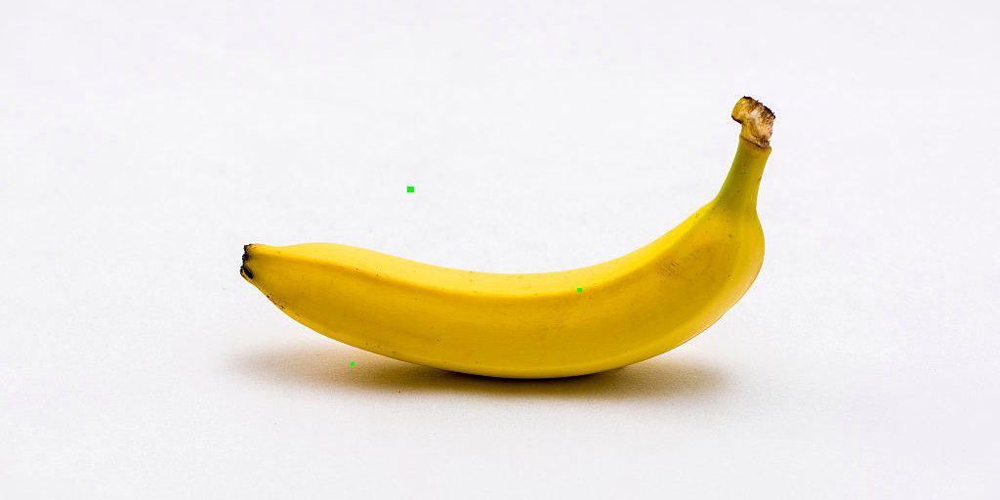
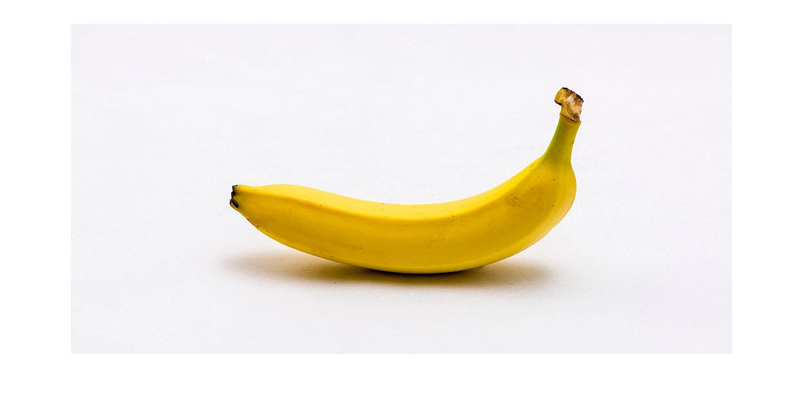
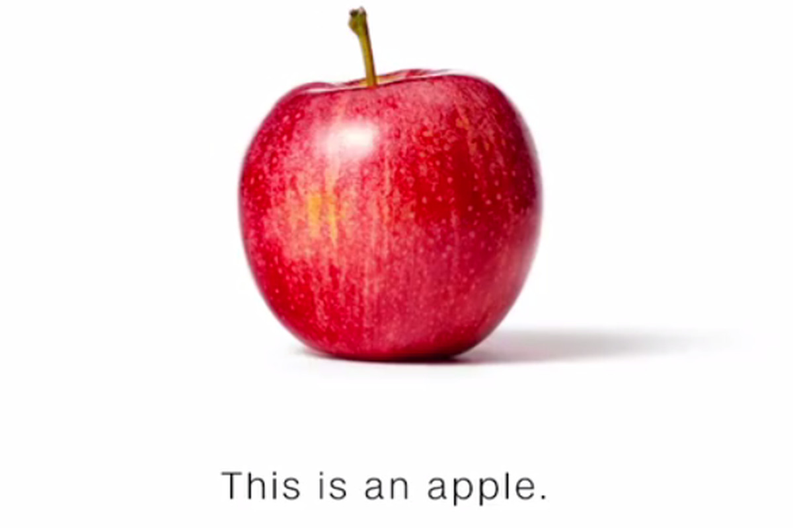
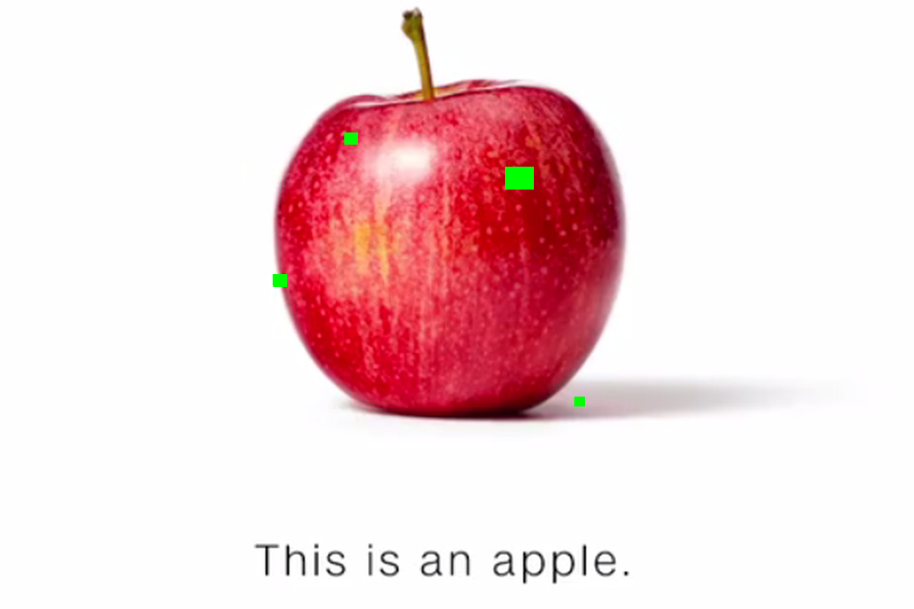
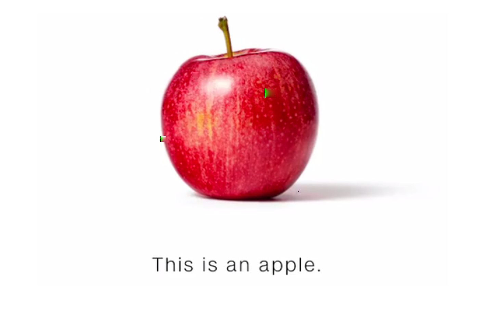

# digitalImageRestoration
 A matlab project which digitally restores images having square green holes using a Partial Differntial Equation model. The partial differential equation used is 
 a laplace equation in 3D with homogenous dirichlet boundary conditions. The solved PDE then gives us the RGB values that the holes need to have, giving us a restored image.

 

<em>Original Banana image</em>
 
<em>"Damaged" banana image</em>
 
<em>Restored Banana image</em>
 

 
  

<em>Original Banana image</em>
 
<em>"Damaged" banana image</em>
 
<em>Restored Banana image</em>
 

